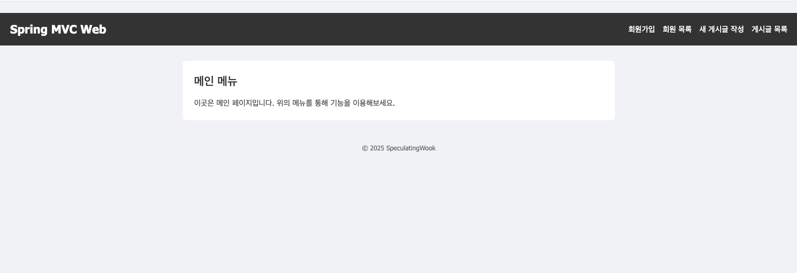

# Spring Study
- 복습겸 정리를 하기 위해 만든 레포입니다.

---

## Spring Boot, Spring MVC

- **SpeculatingWookApplication.java**  
  [src/main/java/speculatingwook/spring/SpeculatingWookApplication.java](src/main/java/speculatingwook/spring/SpeculatingWookApplication.java)

- **WebConfig.java**  
  [src/main/java/speculatingwook/spring/config/WebConfig.java](src/main/java/speculatingwook/spring/config/WebConfig.java)

- **GlobalExceptionHandler.java**  
  [src/main/java/speculatingwook/spring/exception/GlobalExceptionHandler.java](src/main/java/speculatingwook/spring/exception/GlobalExceptionHandler.java)

- **LoggingInterceptor.java**  
  [src/main/java/speculatingwook/spring/interceptor/LoggingInterceptor.java](src/main/java/speculatingwook/spring/interceptor/LoggingInterceptor.java)

---

## Spring MVC, Thymeleaf

- **SpringMemberControllerV3.java**  
  [src/main/java/speculatingwook/spring/web/springmvc/v3/SpringMemberControllerV3.java](src/main/java/speculatingwook/spring/web/springmvc/v3/SpringMemberControllerV3.java)

- **BoardController.java**  
  [src/main/java/speculatingwook/spring/web/springmvc/board/BoardController.java](src/main/java/speculatingwook/spring/web/springmvc/board/BoardController.java)

- **index.html**  
  [src/main/resources/templates/index.html](src/main/resources/templates/index.html)

- **members/new-form.html**  
  [src/main/resources/templates/members/new-form.html](src/main/resources/templates/members/new-form.html)

- **members/save-result.html**  
  [src/main/resources/templates/members/save-result.html](src/main/resources/templates/members/save-result.html)

- **members/list.html**  
  [src/main/resources/templates/members/list.html](src/main/resources/templates/members/list.html)

- **board/new-form.html**  
  [src/main/resources/templates/board/new-form.html](src/main/resources/templates/board/new-form.html)

- **board/save-result.html**  
  [src/main/resources/templates/board/save-result.html](src/main/resources/templates/board/save-result.html)

- **board/list.html**  
  [src/main/resources/templates/board/list.html](src/main/resources/templates/board/list.html)

- **board/detail.html**  
  [src/main/resources/templates/board/detail.html](src/main/resources/templates/board/detail.html)

- **fragments/header.html**  
  [src/main/resources/templates/fragments/header.html](src/main/resources/templates/fragments/header.html)

- **fragments/footer.html**  
  [src/main/resources/templates/fragments/footer.html](src/main/resources/templates/fragments/footer.html)

---

## 데이터 바인딩 및 유효성 검사

- **Member.java**  
  [src/main/java/speculatingwook/spring/domain/member/Member.java](src/main/java/speculatingwook/spring/domain/member/Member.java)

- **Board.java**  
  [src/main/java/speculatingwook/spring/domain/board/Board.java](src/main/java/speculatingwook/spring/domain/board/Board.java)

- **MemberService.java**  
  [src/main/java/speculatingwook/spring/service/MemberService.java](src/main/java/speculatingwook/spring/service/MemberService.java)

- **BoardService.java**  
  [src/main/java/speculatingwook/spring/service/BoardService.java](src/main/java/speculatingwook/spring/service/BoardService.java)

---

## 인터셉터 및 예외 처리

- **LoggingInterceptor.java**  
  [src/main/java/speculatingwook/spring/interceptor/LoggingInterceptor.java](src/main/java/speculatingwook/spring/interceptor/LoggingInterceptor.java)

- **GlobalExceptionHandler.java**  
  [src/main/java/speculatingwook/spring/exception/GlobalExceptionHandler.java](src/main/java/speculatingwook/spring/exception/GlobalExceptionHandler.java)

---

## 게시판 기능 구현

- **BoardController.java**  
  [src/main/java/speculatingwook/spring/web/springmvc/board/BoardController.java](src/main/java/speculatingwook/spring/web/springmvc/board/BoardController.java)

- **BoardRepository.java**  
  [src/main/java/speculatingwook/spring/domain/board/BoardRepository.java](src/main/java/speculatingwook/spring/domain/board/BoardRepository.java)

---

## 웹 프론트엔드 (HTML, CSS, JavaScript)

- **style.css**  
  [src/main/resources/static/css/style.css](src/main/resources/static/css/style.css)

- **app.js**  
  [src/main/resources/static/js/app.js](src/main/resources/static/js/app.js)

---