## Spring basics

### 구성 파일에서 정의된 빈 간 관계 구현하기
- Spring 프레임워크에서 구성 파일(예: application.xml)을 사용하여 빈을 정의합니다. 
- 빈 간의 의존 관계를 설정하고, 해당 관계를 코드에서 구현합니다. 
- 빈 간 관계가 올바르게 구현되었는지 확인하기 위해 실행 결과를 확인합니다. 
- 결과물로 빈 간 관계가 구현된 코드와 실행 결과 스크린샷을 제출합니다.
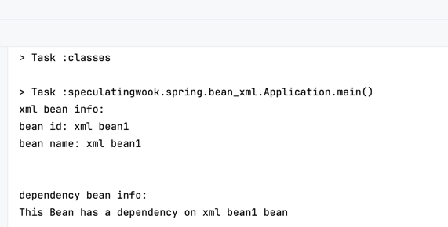
- [코드](/src/main/java/speculatingwook/spring/bean_xml/Application.java)

### 애너테이션을 사용하여 빈 주입하기
- Spring 프레임워크에서 애너테이션(@Autowired, @Inject 등)을 사용하여 빈을 주입합니다. 
- 애너테이션을 이용하여 빈 의존성을 설정하고, 해당 방식으로 빈을 주입하는 코드를 작성합니다. 
- 애너테이션으로 주입된 빈이 올바르게 동작하는지 확인하기 위해 실행 결과를 확인합니다. 
- 결과물로 애너테이션으로 주입된 빈의 실행 결과 스크린샷을 제출합니다.
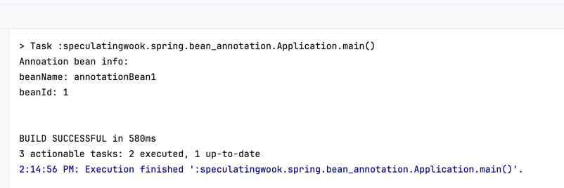
- [코드](/src/main/java/speculatingwook/spring/bean_annotation/Application.java)

### JavaConfig를 사용한 빈 설정
- XML이 아닌 @Configuration과 @Bean을 사용하여 빈을 정의하고, 의존 관계를 설정합니다. 
- 결과물로 JavaConfig 기반의 빈 설정 코드 및 실행 결과 스크린샷을 제출합니다.
  
- [코드](/src/main/java/speculatingwook/spring/bean_annotation/Application.java)

### 인터페이스를 사용하여 의존성 주입하기
- Spring 프레임워크에서 인터페이스를 활용하여 의존성을 주입합니다. 
- 인터페이스를 정의하고, 구현 클래스를 생성합니다. 
- 인터페이스 기반 의존성 주입 코드를 작성하고, 실행 결과를 확인합니다. 
- 결과물로 인터페이스 기반 의존성 주입 코드와 실행 결과 스크린샷을 제출합니다.
  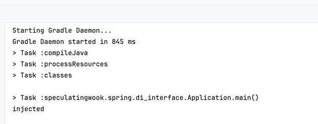
- [코드](/src/main/java/speculatingwook/spring/di_interface/Application.java)

### 순환 의존성 해결하기
- Spring 프레임워크에서 발생할 수 있는 순환 의존성 문제를 해결합니다. 
- 순환 의존성이 발생하는 상황을 재현하고, 이를 해결하기 위한 코드를 작성합니다. 
- 순환 의존성 문제가 해결되었는지 확인하기 위해 실행 결과를 확인합니다. 
- 결과물로 순환 의존성 문제를 해결한 코드와 실행 결과 스크린샷을 제출합니다.
  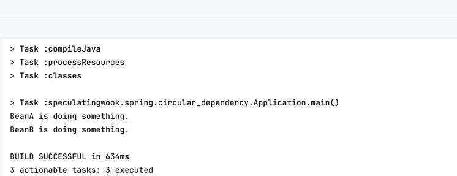
- [코드](/src/main/java/speculatingwook/spring/circular_dependency/Application.java)

### 싱글톤 빈 스코프와 프로토타입 빈 스코프 구현하기
- Spring 프레임워크에서 제공하는 싱글톤 빈 스코프와 프로토타입 빈 스코프를 구현합니다. 
- 각 스코프의 특성을 이해하고, 이를 코드에 적용합니다. 
- 각 스코프의 빈 동작 방식이 올바르게 구현되었는지 확인하기 위해 실행 결과를 확인합니다. 
- 결과물로 각 스코프의 빈 동작 방식이 나타난 스크린샷을 제출합니다.
  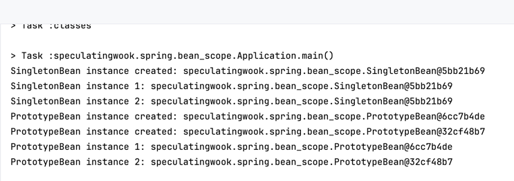
- [코드](/src/main/java/speculatingwook/spring/bean_scope/Application.java)

### 빈 라이프사이클 메서드 활용하기
- @PostConstruct와 @PreDestroy 애너테이션을 사용하여 빈의 라이프사이클을 제어하고 실행 결과 스크린샷을 제출합니다.
  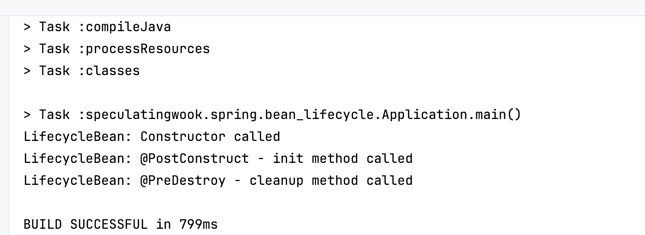
- [코드](/src/main/java/speculatingwook/spring/bean_lifecycle/Application.java)

###  @Primary를 사용하여 기본 빈 설정하기
- 같은 타입의 여러 빈이 있을 때 @Primary를 사용하여 기본적으로 주입될 빈을 설정하는 방법을 구현하고 실행 결과 스크린샷을 제출합니다.
  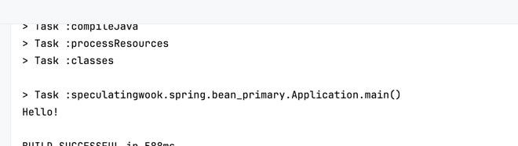
- [코드](/src/main/java/speculatingwook/spring/bean_primary/Application.java)

### Qualifier를 사용하여 동일한 타입의 빈 주입 제어하기
- 동일한 타입의 여러 빈이 있을 때 @Qualifier를 사용하여 특정 빈을 선택적으로 주입하는 방법을 구현하고 실행 결과 스크린샷을 제출합니다.
  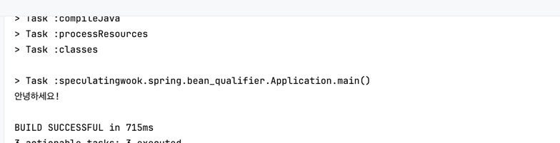
- [코드](/src/main/java/speculatingwook/spring/bean_qualifier/Application.java)

### 프로퍼티 파일을 이용한 환경 설정 주입하기
- application.properties 또는 application.yml을 활용하여 설정 값을 주입합니다. 
- 실행 결과를 통해 주입된 값이 올바르게 동작하는 지 확인하고 실행 결과 스크린샷을 제출합니다.
  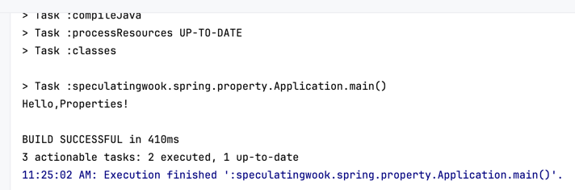
- [코드](/src/main/java/speculatingwook/spring/property/Application.java)

### AOP를 사용하여 애스펙트 구현하기
- Spring 프레임워크의 AOP(Aspect-Oriented Programming) 기능을 활용하여 애스펙트를 구현합니다. 
- 애스펙트를 정의하고, 타깃 메서드에 애스펙트를 적용합니다. 
- AOP가 올바르게 동작하는지 확인하기 위해 실행 결과를 확인합니다. 
- 결과물로 AOP를 적용한 코드와 실행 결과 스크린샷을 제출합니다.
  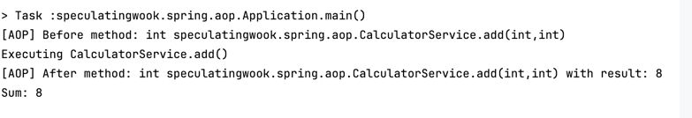
- [코드](/src/main/java/speculatingwook/spring/aop/Application.java)

### AOP를 사용한 트랜잭션 관리 구현하기
- AOP를 사용하여 트랜잭션을 관리하는 애스펙트를 구현합니다. 
- @Transactional 애너테이션과 AOP를 결합하여 메서드 실행 전후로 트랜잭션을 제어하고, 예외 발생 시 롤백을 처리합니다. 
- 결과물로 AOP를 활용한 코드와 실행 결과 스크린샷을 제출합니다.
  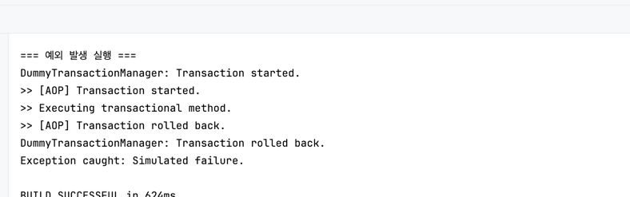
- [코드](/src/main/java/speculatingwook/spring/transactional/Application.java)
